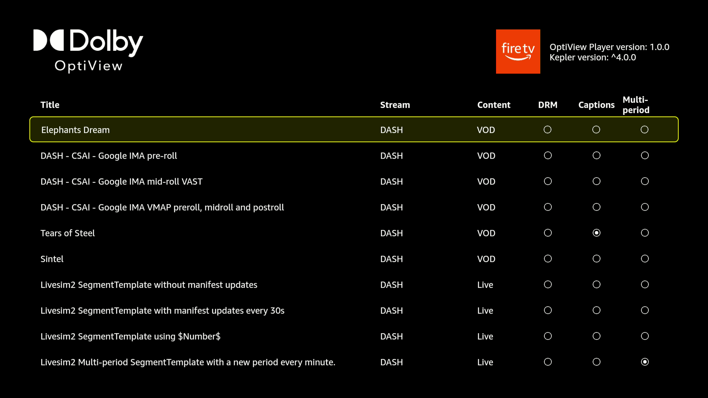

## Example Application

The example application builds upon the `@dolby-optiview/react-native-vega` package to create a functional
Vega app.

The `@dolby-optiview/react-native-vega` package is a private npm package, located in the `lib/` folder,
which provides a `THEOplayerView` component that aligns with our `react-native-theoplayer` SDK.



### Prerequisites

- Vega SDK **v0.24** with a device running **Vega OS 1.2** or newer and supporting Vega React Native runtime 4.
- Node.js **22.14.0** or newer.
- This sample uses **React Native 0.83.0**, **React 19.2.0**, and **Dolby OptiView Vega 1.0.0**.
- In order to use one of these OptiView SDKs, it is necessary to obtain a **valid React Native OptiView license**. You can sign up for an OptiView SDK license through [our portal](https://portal.theoplayer.com/).
- The local npm OptiView packages and THEOmux dependency, which are not publicly available yet but provided in the `lib` folder:
    - `@dolby-optiview/vega`: Dolby OptiView native SDK for Vega.
    - `@dolby-optiview/react-native-vega`: React Native API for Vega.
    - `@theoplayer/theomux-vega`: Turbo module hosting THEOmux transmuxing functionality for TS-based HLS streams.
- Ads use the supplied `@logituit-rel/logix-ads-manager` **0.3.0+theoplayer.3** archive. See the [patch notes](../lib/LOGIX_AD_MANAGER_PATCH.md) for installation, behavior, and limitations.
- Optionally, Visual Studio Code with Vega plugins is installed.

### Configure the license

1. Obtain a valid OptiView React Native license with Vega support from [the license portal](https://portal.theoplayer.com/).
2. From the sample repository root, copy [`.env.example`](../.env.example) to `.env` if you do not already have one:

   ```sh
   cp -n .env.example .env
   ```

3. Open `.env` and replace the empty value with your license key:

   ```dotenv
   DOLBY_LICENSE_KEY=your_dolby_optiview_license_key
   ```

   Replace the placeholder above with the actual key. You do not need to edit `src/screens/PlayerScreen.tsx`: it imports `DOLBY_LICENSE_KEY` through the configured `react-native-dotenv` Babel plugin and passes it to the player's `license` property.

4. After changing `.env`, restart Metro with its cache reset for development:

   ```sh
   npm start -- --reset-cache
   ```

   For a release app, rebuild and reinstall with `npm run app:release`. The release build script resets Metro's transform cache because changing `.env` alone can otherwise reuse an older inlined license, even after rebuilding. When invoking the CLI directly, include `--reset-cache`. Reloading an already-built release app does not update its license.

Local `.env` files are ignored by Git; keep your actual key there, not in `.env.example` or committed source code. The value is embedded in the JavaScript bundle at build time, not fetched from `.env` on the device.

If `.env` is missing or `DOLBY_LICENSE_KEY` is blank, the license remains unset. Sources outside the release SDK's built-in demo domains require a valid license covering those sources.

### Build

Install dependencies:

`npm ci`

The standalone Vega adapter uses shared API definitions from `react-native-theoplayer@10.13.0`. Keep that dependency installed. The sample's Metro resolver routes bare `react-native-theoplayer` imports to `@dolby-optiview/react-native-vega`, while preserving the shared API subpaths and Vega's React Native runtime mapping. This also ensures the UI and DRM connectors use the Vega implementation.

Run `npm test`, `npm run typescript`, and `npm run lint` to check the sample before building.

[Configure the license](#configure-the-license) before building or starting Metro.

Then build & run preferable using Visual Studio Code's Vega extensions, or alternatively:

`npm run app:release`


### Player creation

The player is created using the `THEOplayerView` component. A basic example is shown below:

```tsx
import React, {useState} from 'react';
import {DOLBY_LICENSE_KEY} from '@env';
import {View} from 'react-native';
import {THEOplayer, PlayerConfiguration, THEOplayerView} from '@dolby-optiview/react-native-vega';

const playerConfig: PlayerConfiguration = {
  // The license is loaded from your local .env file.
  license: DOLBY_LICENSE_KEY?.trim() || undefined,
};

export const App = () => {
  const [player, setPlayer] = useState<THEOplayer | undefined>(undefined);

  const onPlayerReady = (player: THEOplayer) => {
    setPlayer(player);
    player.autoplay = true;
    player.source = {
      "sources": [
        {
          "src": "https://cdn.theoplayer.com/video/sintel/nosubs.m3u8",
          "type": "application/x-mpegurl"
        }
      ]
    };
  };

  return (
    <View style={{flex: 1}}>
      <THEOplayerView config={playerConfig} onPlayerReady={onPlayerReady} />
    </View>
  );
}
```

### Headless player

Optionally, a player can be created in headless mode, already providing it with a source.

```tsx
import {DOLBY_LICENSE_KEY} from '@env';

const playerConfig: PlayerConfiguration = {
  // The license is loaded from your local .env file.
  license: DOLBY_LICENSE_KEY?.trim() || undefined,
};

const vegaPlayer = await THEOplayer.create(playerConfig);
vegaPlayer.source = { /*...*/};
```

The headless player can then be attached to a `THEOplayerView` component later on:

```tsx
<THEOplayerView player={vegaPlayer} />
```
